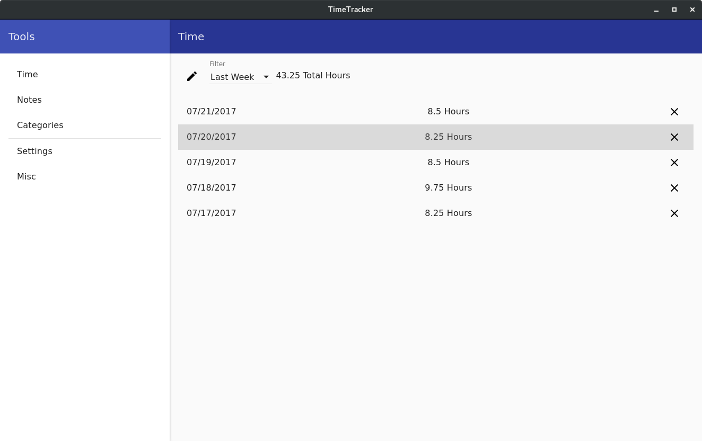

# TimeTracker
An electron app for tracking time

## Usage

### Installing
`$ git clone git@github.com:jpfeiffer16/TimeTracker.git`

`$ cd TimeTracker`

Install bower if you don't have it:

`$ npm install -g bower`

Install deps:

`$ npm install`

Now install front-end deps with bower.

`$ bower install`

Now run `npm start` to launch the app.

### Manually adding a desktop file.
If you would like to be able to run the program from your desktop launcher,
copy the file ~/install/TimeTracker.desktop to your ~/.local/share/applications
folder.

Will work on a global install option in the future.

### Notes:
Currently only Windows and Linux are supported.

Destop launcher only works on linux currently.

### Existing pre-Jira-Integration DB migrations:
If you have a sqlite db used by the app that is older than the jira-integration addition,
you will need to execute the sql in the file ~/dbscripts/addSyncedToTasks.sql on your db before 
it will work with the app again.

### Technical Details

Time, Notes and stats are stored in a SQLite DB the path to which is specified in
Settings > DB Path